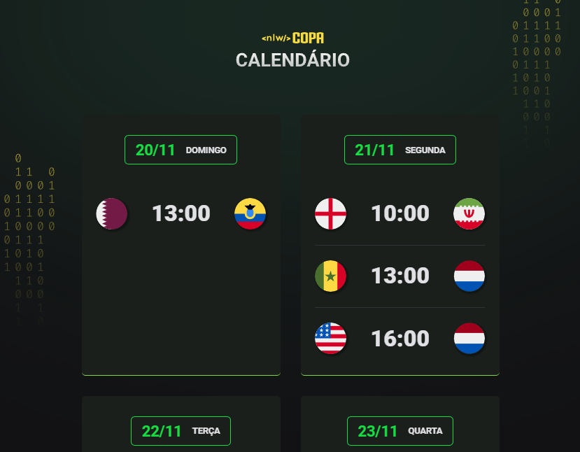

<h1 align="center"> NLW - World Coup </h1>

## 💻 Projeto

- O Calendário da Copa é um projeto que mostra os jogos da Copa de 2022.
- Trilha Explorer: Projeto construído do evento Next Level Week da Rocketseat.
[Clique aqui para acessar](https://rebanned.github.io/NLW-Copa/)

## 🚀 Tecnologias

Esse projeto foi desenvolvido com as seguintes tecnologias:

- HTML e CSS
- JavaScript
- Git e Github

## ✉️ Contato

lucaseduard.dev@gmail.com